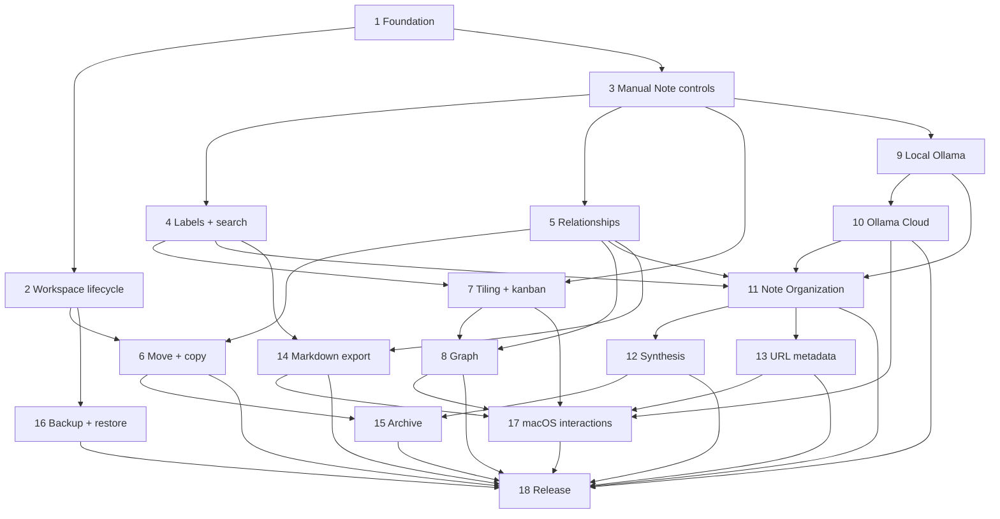

# Nodepad V0 child-issue plan

Parent: GitHub issue #1

Design target: thin, decision-complete AFK slices sized for Sonnet, Kimi 2.6, or GPT-5.4 Mini with a roughly 150K context window. Each slice delivers an observable path, owns its migrations and tests, follows the repository workflow, and opens one PR against `main`.

All slices are AFK. No HITL slice remains because product scope, privacy, Relationship semantics, AI application behavior, search scope, Ollama hosts, and both AI prompts are approved.

## 1. Bootstrap the Tauri shell and persist the first Note

- **Type:** AFK
- **Blocked by:** None
- **User stories:** 1, 2, 3, 7, 11, 12, 68
- **Complete path:** launch a Tauri 2 macOS app, create a Thinking Workspace and Note, commit through the Thinking Workspace interface into SQLite, quit, reopen, and recover the Note.
- **Scope fence:** minimal shell, minimal capture UI, first schema migration, SQLite and in-memory conformance harness, blocking TypeScript/Rust/test gates. Do not migrate the full legacy UI.

## 2. Complete Thinking Workspace lifecycle and recovery states

- **Type:** AFK
- **Blocked by:** 1
- **User stories:** 4, 5, 6, 13
- **Complete path:** create, select, rename, confirm-delete, and recover Workspaces through durable intents; always leave one valid Workspace; surface database-open failures safely.

## 3. Complete manual Note editing, Note Type, Annotation, pinning, and undo

- **Type:** AFK
- **Blocked by:** 1
- **User stories:** 8, 9, 10, 14, 15, 16, 19
- **Complete path:** edit/delete/pin a Note, assign the fixed Note Type, edit Annotation, and undo recent committed mutations through compensating transactions.

## 4. Add Workspace Labels and active-Workspace search

- **Type:** AFK
- **Blocked by:** 3
- **User stories:** 17, 18, 31, 32
- **Complete path:** create/attach/rename/remove case-normalized Labels and search Note text, Annotation, and Labels inside only the active Workspace using SQLite full-text search.

## 5. Add manual Relationships and enforce Thinking Graph invariants

- **Type:** AFK
- **Blocked by:** 3
- **User stories:** 20, 21
- **Complete path:** link/unlink Notes from the Note detail surface and query related Notes. Relationships are symmetric, untyped, Workspace-local, unique per Note pair, and record manual/AI provenance.

## 6. Move and copy Notes safely between Workspaces

- **Type:** AFK
- **Blocked by:** 2, 5
- **User stories:** 22, 23, 24, 25
- **Complete path:** move a Note while removing now-invalid Relationships; copy a Note with fresh identity and no inherited Relationships; commit each operation atomically.

## 7. Reconnect tiling and kanban views to committed Workspace projections

- **Type:** AFK
- **Blocked by:** 3, 4
- **User stories:** 26, 27, 29
- **Complete path:** render the same committed Notes through automatic tiling and Note-Type kanban views; edits in either view persist and appear identically after switching/restart.

## 8. Reconnect the graph view and Relationship focus behavior

- **Type:** AFK
- **Blocked by:** 5, 7
- **User stories:** 28, 30
- **Complete path:** derive nodes, links, degree, and focus from the Thinking Graph; selection/hover emphasizes the same related Notes across graph, tiling, and kanban without changing durable state.

## 9. Add Assistance Policy and local Ollama model discovery

- **Type:** AFK
- **Blocked by:** 3
- **User stories:** 33, 34, 35, 36, 38, 41
- **Complete path:** switch a Workspace between Manual and Local AI, connect only to `http://localhost:11434`, fetch/refresh/search/select models, recognize cloud-capable models exposed locally, persist non-secret preference, and show unavailable/missing-model states.
- **Scope fence:** no custom host and no Note organization yet.

## 10. Add Ollama Cloud consent, keychain secret, and model discovery

- **Type:** AFK
- **Blocked by:** 9
- **User stories:** 39, 40, 41, 42, 43, 45
- **Complete path:** explicitly consent per Workspace, store/revoke the bearer key through macOS keychain, connect only to `https://ollama.com`, fetch/refresh/search/select cloud models, and stop cloud requests immediately when policy changes.

## 11. Implement automatic Note Organization with approved Prompt A

- **Type:** AFK
- **Blocked by:** 4, 5, 9, 10
- **User stories:** 37, 44, 46, 47, 48, 49, 50
- **Complete path:** after Note create/edit in an AI-enabled Workspace, run the approved combined organization prompt through local or cloud Ollama, validate its schema, auto-apply one Note Type, zero-to-three Labels, optional Annotation, and zero-to-five strong Relationships, and expose retry/failure states.
- **Decision lock:** discard stale/invalid results atomically; manual values win; explicit Re-enrich and Replace is the only override; at most ten same-Workspace candidate Notes; no merge, confidence, unrelated flag, or hidden extra prompt.

## 12. Implement provisional Synthesis with approved Prompt B

- **Type:** AFK
- **Blocked by:** 11
- **User stories:** 51, 52, 53, 54
- **Complete path:** evaluate eligibility, run the approved Synthesis prompt, accept a grounded result as a fresh thesis Note, dismiss it, enforce pending/cooldown limits, and prevent semantic repeats using bounded history.
- **Decision lock:** `found: false` is valid; a result needs two-to-five exact source Note IDs; Synthesis never auto-accepts.

## 13. Add safe native URL metadata enrichment

- **Type:** AFK
- **Blocked by:** 11
- **User stories:** 55, 56
- **Complete path:** detect a URL reference Note, retrieve bounded public HTTP(S) metadata through Rust, reject unsafe destinations and redirects after resolution, and pass validated metadata into Prompt A without giving fetched content instructional authority.

## 14. Add native Markdown export

- **Type:** AFK
- **Blocked by:** 4, 5
- **User stories:** 57
- **Complete path:** choose a destination through the native save dialog and export one Workspace as readable Markdown organized by Note Type and Labels with Annotations, Relationships, sources, and timestamps.

## 15. Add the versioned Nodepad archive workflow

- **Type:** AFK
- **Blocked by:** 6, 12
- **User stories:** 58, 59, 60, 61
- **Complete path:** export complete durable Workspace state, validate a V0 archive fully before mutation, remap imported identity and Relationships in one transaction, and exclude secrets/transient state.
- **Scope fence:** no legacy browser archive compatibility.

## 16. Add rotating backup, restore, and migration safety

- **Type:** AFK
- **Blocked by:** 2
- **User stories:** 62, 63, 64
- **Complete path:** create migration backups, create at most one changed-data backup daily, retain seven, validate before restore, preserve a pre-restore backup, and reopen cleanly.

## 17. Complete macOS keyboard, accessibility, and external-link behavior

- **Type:** AFK
- **Blocked by:** 7, 8, 10, 13, 14
- **User stories:** 65, 66
- **Complete path:** verify capture, command palette, undo, escape, focus, reduced motion, semantic status, modal focus, and macOS-approved external link opening across the completed surfaces.

## 18. Harden privacy gates and produce the V0 macOS artifact

- **Type:** AFK
- **Blocked by:** 6, 8, 10, 11, 12, 13, 14, 15, 16, 17
- **User stories:** 1, 2, 42, 44, 61, 67, 68
- **Complete path:** prove no telemetry/sync/secret leakage, run the complete TypeScript/Rust/test/build gate, launch against clean app data, exercise the offline restart smoke path, build the Apple Silicon macOS artifact, and document signing/notarization as manual when credentials are unavailable.

## Dependency shape

## Publication rules after approval

- Publish in dependency order so every blocker has a real GitHub issue number.
- Every issue links Parent #1 and lists actual blockers.
- Every issue includes its relevant parent decisions, exact acceptance criteria, focused tests, scope fence, and mandatory repository delivery workflow.
- Prompt A is embedded only in the Note Organization issue; Prompt B only in the Synthesis issue. Other agents do not need to load prompt text.
- Apply only `ready-for-agent` when the issue has no unresolved human decision. Dependency blocking remains explicit even while labeled ready.
- Do not close or rewrite Parent #1.
